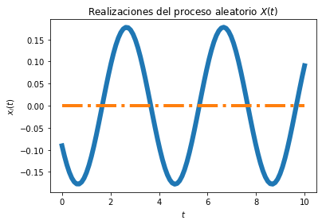

# Laboratorio 4

**Estudiante:** Ariana Méndez García

**Carné:** B54341

---


```python
# Base para la solución del Laboratorio 4

# Los parámetros T, t_final y N son elegidos arbitrariamente

import numpy as np
from scipy import stats
import matplotlib.pyplot as plt

# Variables aleatorias y sus respectivos intervalos
vaC = stats.norm(5, np.sqrt (0.2)) 
vaW = stats.norm((2 * np.pi * 59.1), (60.1 * 2 * np.pi)) 
vaZ = stats.norm (0, (np.pi / 2))

# Se escogen las siguientes valores respectando los intervalos de las variables
Z = 1.2
w = 375

# Creación del vector de tiempo
T = 100			# número de elementos
t_final = 10	# tiempo en segundos
t = np.linspace(0, t_final, T)

# Inicialización del proceso aleatorio X(t) con N realizaciones
N = 10
X_t = np.empty((N, len(t)))	# N funciones del tiempo x(t) con T puntos

# Creación de las muestras del proceso x(t) (C y Z independientes)
for i in range(N):
	C = vaC.rvs()
	x_t = C * np.cos(w*t + Z) 
	X_t[i,:] = x_t
	#plt.plot(t, x_t)

# Promedio de las N realizaciones en cada instante (cada punto en t)
P = [np.mean(X_t[:,i]) for i in range(len(t))]
plt.plot(t, P, lw=6)

# Valor teórico de la media
E = 10 / np.pi * (np.cos (w * t) - np.sin (w * t))
print("El valor teórico de la media es:",np.mean(E),"\n")

# Graficar el resultado teórico del valor esperado
plt.plot(t, E, '-.', lw=4)

# Mostrar las realizaciones, y su promedio calculado y teórico
plt.title('Realizaciones del proceso aleatorio $X(t)$')
plt.xlabel('$t$')
plt.ylabel('$x_i(t)$')
plt.show()

# T valores de desplazamiento tau
desplazamiento = np.arange(T)
taus = desplazamiento/t_final

# Inicialización de matriz de valores de correlación para las N funciones
corr = np.empty((N, len(desplazamiento)))

# Nueva figura para la autocorrelación
plt.figure()

# Cálculo de correlación para cada valor de tau
for n in range(N):
	for i, tau in enumerate(desplazamiento):
		corr[n, i] = np.correlate(X_t[n,:], np.roll(X_t[n,:], tau))/T
	plt.plot(taus, corr[n,:])

# Valor teórico de correlación
Rxx = 25.2 * np.cos (w * t + Z) * np.cos (w * (t + taus) + Z)

# Gráficas de correlación para cada realización y la
plt.plot(taus, Rxx, '-.', lw=4, label='Correlación teórica')
plt.title('Funciones de autocorrelación de las realizaciones del proceso')
plt.xlabel(r'$\tau$')
plt.ylabel(r'$R_{XX}(\tau)$')
plt.legend()
plt.show()
```

    El valor teórico de la media es: -0.20725637572176353 
    
    


    

    


    

    

